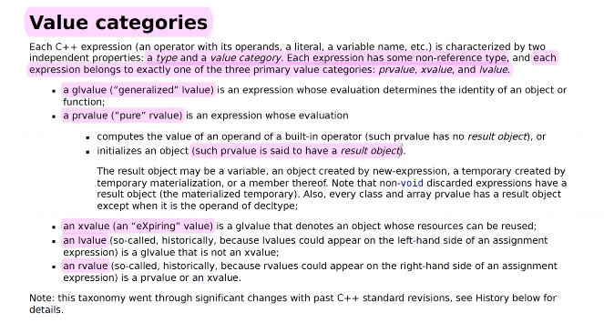
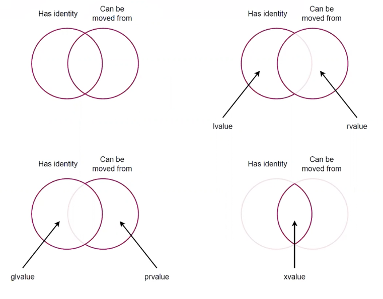
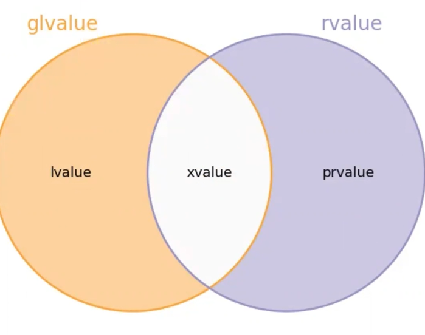

# 1. Ders

Bu ders özelinde spesifik olarak temel sentaks üzerine eklemeler yapılacak ve C++17,20,23 ile alakalı kavramlarada yer verilecek.

```c++
#include <iostream>
int main()
{
    std::cout << "merhaba dunya" << std::endl;
}
```

Bu basit kod içerisinde bile:

- Sınıflar
- Operator overloader
- Templateler var. (class, function )
- Kalıtım var. (Multiple inharitance, inharitance, virtual inharitance)
- Function overloading
- ADL (argument dependendt lookup)
- Referans semantiği
- std::engl bir fonksiyonu şablonu (ostream manipulator)
- Chaining var

Araçların birbiri ile ilişkisi çok fazla var.

C/C++ ayrışmasının nedeni:

- C++'ta olan ve C'de olmayan bazı araçlar için o kuralların değiştirilmesi gerekti. Örneğin *value category*.
- C' dilinde olan C99 ile eklenen fakat C++ ile olmayan araçlar, designated initializers, compound literals, restrict pointer, flexible array member ...

## İfade Kategorileri ( Expression )

C/C++'ta en temel birim. Dilin sentaksına ilişkin bir çok kural bununla alakalı.

Bir ifadenin 2 temel niteliği var


*ifadenin türü*:

- O ifadenin kullanıldığı bağlamda, sentaks hatası olup olmamasında belirli.
- İfadenin türü, derleyicinin orada nasıl bir kod üreteceğini belirliyor.
- Function overloading'te hangi fonksiyonun seçileceği konusunda belirleyici oluyor.
- İfadenin türü **referans** olamaz

`int x = 5 ; int & r = x;` dediğimizde burada `r` ifadesinin türü *int*.

*value category*:

Bir ifadenin value category'si her konuda daha çok belirleyici oluyor.

**L-value expression:**: İlk çıkış itabariyle, *left-value* atama operatörünün sol operandı olmasından geliyor. Kavramsal olarak left value'nun dışına çıkan ifadeler de var ( örneğin const ).

- **modifable**  L-value: Sol operandı olabilen.
- **unmodifable**  L-value: Sol operandı olamayan.

Daha sonra bunu **Locatable** olarak değiştirildi.

C'de kategori 2 ye ayrılıyor, **L-value** ya da **R-value**.

Fakat C++ dilinde C++11'e kadar neredeyse C ile aynıydı. Modern C++ ile gelen *taşınma semantiği* ve *perfect forwarding* geldi ve burada value categorylerinde büyük bir değişim oldu.

---

`int x = 6;`  Bu bir ifade değil!

Value category sadece ve sadece expressiona özel, Değişkinin bir **value category'**si olmaz!!!!!

---

Modern C++ ile dilin value category kavramını değiştirip, 5 tane olucak şekilde güncellendi. Bunlardan 3'üne **Primary Value Category** (Pr-value, L-value, X-value). Bir ifade mutlaka bu kategoriden birine ilişkin olmak zorunda (Örtülü dönüşümler sonucundaki value category kast edilmiyor, static olarak bakıldığı zaman.).

- Pr-value: Pure R value
- L-value: Locators value
- X-value: Expiring value

Kelime anlamı ile doğrudan bir ilişki yok.

**mixed/combined value category**:

- GL Value: O ifade L-value ya da X value ise.
- R Value: C++ içerisinde combined bir kategori. Pr value ya da X Value ise.



> A Pr-value is an expression whose evalutation:
> **computes the value of an operand of a built-in operator** or
> initializes an object (*result object* C++17 ile eklendi.)

Bir ifadenin değer kategorisi 2 temel özelliğini belirleyip derleyicilerin ona göre kod üretmesini sağlıyor.

*identity*'ye sahip olup olmamasını belirtiyor ve *movebility* o nesnenin kaynakları tekrar kullanılabilir mi?



Bir identity'si olan ifadelere GL-value. Bellekte bir adrese sahip mi? O adrese erişilebiliyor mu? Bizim bir değişkenimiz var ve o değişkeni bir ifade kullanarak o adrese erişebiliyoruz.

Taşıma yapılabiliyorsa RValue ifadeler.

- **L-value**: Kimliği olan ve taşınamayan ifadeler.
- **PR-Value**: Kimliği olmayan fakat taşınabilen ifadeler.
- **X-Value**: Kimliği olan ve taşınabilenler.



Buradaki kategoriler bizi 1. olarak referanslar konusunda ilgilendiriliyor, 2.olarak type-deduction konusunda , 3.olarak function overload resolution'da.

## Referanslar

C++ dilinde 3 çeşit referans var:

- L value reference. tek `T &` ile tanımlanıyor.
- R value reference. çift `T &&` ile tanımlanıyor.
- Forwarding/universal reference () - asıl varlık nedeni *perfect forwarding*i implemente etmek, başka amaçlarla da kullanılabiliyor.

Burada referansın hangi kategoride olduğu, o referansa hangi value kategorisinde const ya da non-const hangi ifadelerin bağlanabileceğini saptıyor.

### İfadelerin hangi kategoriye ait

Dilin kuralları bunu detaylı bir şekilde anlatıyor. Value-category ile `decltype` yakından ilişkili.

---

**decltype** operatörü hatırlatma:

2 farklı görevi var:

- 1. operand olarak bir isim kullanılması farklı, buna `(.) ve (->)` operatorleri de dahil.
O isim hangi türden declare edildiyse ben o türden bir değişken olurum.

```c++
#include<iostream>
struct Myclass  {int a;};
int main()
{
    int x = 10;
    itn & r = x;
    const int &cr = x;
    int * ptr = &x;
    decltype(x); //int
    decltype(r) a = x; //int & 
    decltype(cr) a = 10 ; //const int r;
    
    Myclass m{};
    decltype(m.a) c;// int c;
    int && b = 5;
    decltype(b); //int &&
}
```

- 2. operand'ı isim formunda olmayan bir ifade olucak. Burada bir tür elde edilecek ama elde edilen tür ifadenin value category'si tarafından belirlenecek.

3 tane ihtimal var, eğer ifade expr ===> T diyelim bu durumda,

- PrValue ise - T
- LValue ise - T&
- XValue ise - T&&

```c++
int && foo();
struct Neco{int x {};};

decltype(10); //int türü
int x{3};
int *p{&x};
decltype(x+5); //int
decltype(*p); // int &
decltype((x)); //int &
decltype(foo()); //int &&
decltype(Neco{}.x); //int && 
```

Bu kural ilişkisi örneğin `decltype(c) ile decltype((c))` birbirinden farklı.
> Not! Sağ taraf referansını kullanırken onun bağlandığı nesneyi değiştirmek istiyoruz onun için *const* olmasını çok istemiyoruz.

---

*decltype* specifier'ını kullanarak value kategorisini öğrenebiliriz.

```c++
#include <iostream>

template<typename T>
constexpr const char* p = "PRValue"; //T'nin türü const T* türünden bir değğişken tanımladık
template<typename T>
constexpr const char *p<T&> = "LValue";//Primary templat'in sol taraf referanslar için partial specilization
template<typename T>
constexpr const char *p<T&&> = "XValue"; //Primary templat'in sağ taraf referanslar için partial specilization

#define pvcat(e) std::cout << "value category of '" << #e <<"' is " << p<decltype(e)> <<"\n";
//#e macro argümanını çift turnak içine alıyor
int foo();
int& foo1();
int && foo2();
void foo3();
int foo4(int);
struct Nec{int x{}; static int y;};
int main()
{
    std::cout<< p<int&&> << "\n";//()
    std::cout<< p<int&> << "\n";//()
    std::cout<< p<int> << "\n";//()

    std::cout<< p<decltype(10)> << "\n";//()
    int x = 10;
    std::cout<< p<decltype((x))> << "\n";//()

    pvcat(x+5); // prvalue
    pvcat(x++); // prvalue
    pvcat(x--); // prvalue
    
    pvcat(++x); // lvalue
    pvcat(--x); // lvalue

    pvcat(foo()); //pr-value
    pvcat(foo1()); //l-value
    pvcat(foo2()); //x-value
    pvcat(foo3()); //pr-value

    pvcat(45); //pr-value
    pvcat('A'); //pr-value
    pvcat("ahmet"); //l-value

    pvcat(foo); //l-value

    pvcat(std::move(x)); //x-value
    pvcat(static_cast<int&&>(x)); // xvalue

    pvcat(std::move(foo4)); //fonksiyonlar hangi referans türüne dönüştürülsün her zaman L-value ifadesi olur.

    pvcat(nullptr); //pr-value 

    pvcat(Nec{}); //pr-value
    pvcat([]{return 1;});//pr-value 

    Nec mynec;
    pvcat(mynec);// l-value expression

    auto &r  =mynec;
    pvcat(r); // lvalue
    auto &&r1  =Nec{};
    pvcat(r1); // l-value referans

    pvcat(mynec.x); // l-value
    pvcat(Nec{}.x); // x-value
    pvcat(std::move(mynec).x); // x-value
    pvcat(std::move(mynec).y); // l-value

    int y{},z{};
    pvcat(x > 10 ? y : z); // l-value
    pvcat(x > 10 ? y : 10 ); // pr-value
}
```

> <https://onlinegdb.com/4m5dLTADz>

Function template ile yapılması:

```c++
#include <iostream>
#include <type_traits>
template<typename T>
void func()
{
    if constexpr (std::is_rvalue_reference<T>::value)//std::is_rvalue_reference_v<T>
    {
        std::cout<<"X value";
    }
    else if constexpr(std::is_lvalue_reference<T>::value)
    {
        std::cout<<"L value";
    }
    else if constexpr(!std::is_reference<T>::value)
    {
        std::cout<<"PR value";
    }
}

#define exp(e) decltype((e))

int main()
{
    int x{43};

    func<exp(12)>();
    func<exp(x)>();
}
```

### Function Overloadinge ilişkin kurallar ve hangi referansa hangi referans türleri bağlanabiliyor?

- const olmayan L-value referansa sadece L-value bağlayabiliriz
- Eğer referans const L-value referans ise, const olmayan, const olan bir sınıf nesnesini bağlayabiliriz. Sağ taraf bir sınıf nesnesini bağlayabiliriz. Yani const sol taraf referansına her şeyi bağlayabiliyoruz

Sağ taraf referansına const olsun veya olmasın sadece sağ taraf referansı bağlayabiliyoruz.

- const olmayan sağ taraf referansa sadece const olmayan sağ taraf referans değerleri bağlanabiliyor.
- const olan sağ taraf referansına const/const olmayan sağ taraf referans değerleri bağlanabiliyor.

```c++
#include <type_traits>
struct Nec{};
int main()
{
    Nec x;
    const Nec cx;
    Nec &r = x;    
    const Nec &cr = Nec{};
    const Nec &cr = cx;
    const Nec &cr = x;
    const Nec &cr = std::move(cx);    
}
```

|               | T&             | const T& |       T&&      |    const T&&   |
|---------------|----------------|:--------:|:--------------:|:--------------:|
| Lvalue        |        1       |     2    | Sentaks hatası | Sentaks Hatası |
| const l-value | Sentaks Hatası |     1    | Sentaks Hatası | Sentaks Hatası |
| R value       | Sentaks Hatası |     3    |        1       |        2       |
| const Rvalue  | Sentaks Hatası |     2    | Sentaks Hatası |        1       |

1-2-3 sıralama olarak verilmiştir

```c++
#include <iostream>
struct S{};
void foo(S&){    std::cout << "S&"<< '\n';}
void foo(const S&){    std::cout << "const S&"<< '\n';}
void foo(S &&){    std::cout << "S &&"<< '\n';}
void foo(const S &&){    std::cout << "const S &&"<< '\n';}

int main()
{
    S x;
    const S cx;
    foo(x);
    foo(cx);
    foo(std::move(cx));
}
```

Buradaki farklar move/copy ctor arasındaki farklarda düşünülebilir. Orada da benzer bir overloading mekanizmasını kullanıyoruz.

```c++
Myclass(const Myclass&);
Myclass( Myclass &&);
```

**move** does not move!!!!! Dolayısıyla bir sağ taraf referansına bir nesneyi bağlamak ile taşıma yapılmıyor.

### std::move

Value category dönüşüm fonksiyonu, 2 tane move fonksiyonu var.

- Algorithm başlık dosyasındaki olay, copy assignment yerine move assignment ile yapılsın istediğimiz zaman.
- Fakat utility header file içinde tanımlanan move ise bir dönüşüm fonksiyonu, verilen bir parametre eğer L-value ise R-value çıkar. R-value giren R-value çıkar. Move'un yaptığını `static_cast<T&&>` ile yapabilirdik.

---

*forwarding reference* kullanıyoruz

Eğer fonksiyonun parametresi `T &&` şeklinde yazıldıysa burada tür çıkarım kuralları daha farklı ve bu referansa bütün ifadeler bağlanabiliyor. Bunun en önemli özelliği

- R-value expr çağrı yapılırsa eğer T referans türü değilse R-value olduğnu anlıyoruz. Türün kendisi olucak ve fonksiyon parametresi sağ taraf referans oluyor.
- L-value exp çağrı yapılırsa sol değer referansı oluyor ve burada reference collapsing ile => sol taraf referansına bağlanıyor. Eğer T sol taraf referans türüyse L-value olduğunu anlıyoruz

---

```c++
#include<iostream>
#include<algorithm>

template<typename InIter, typename OutIter>
OutIter Copy(InIter beg, InIter end, OutIter destbeg)
{
    while (beg != end)
    {
        *destbeg++ = *beg++;
    }
    return destbeg;
}
template<typename InIter, typename OutIter>
OutIter Move(InIter beg, InIter end, OutIter destbeg)
{
    while (beg != end)
    {
        *destbeg++ = std::move(*beg++);
    }
    return destbeg;
}

template<typename T>
constexpr  Move(T &&)noexcept
{

}
```
