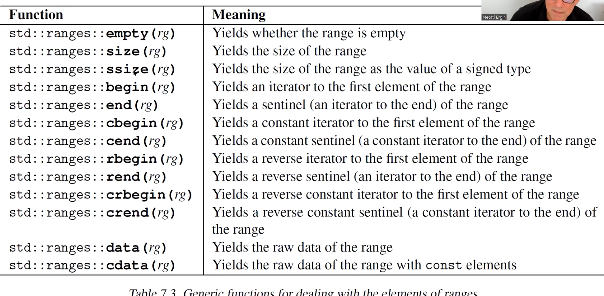
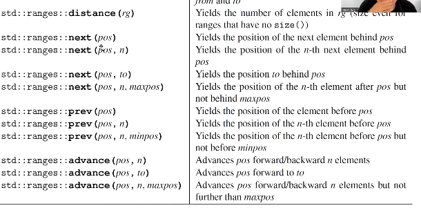
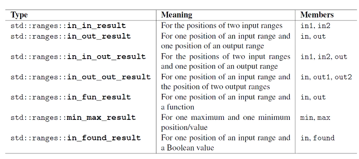

# 13.Hafta

> 22_16_09_2023

## İçindekiler

## Ranges Kütüphanesi

### Generic fonksiyonlar






```c++
void print(std::string_view sv, auto beg, auto end)
{
    std::cout << msg;
    for(auto pos = beg; pos != end; ++pos)
        std::cout << ' ' << *pos;
    std::cout << '\n';
}

int main()
{
    std::vector inCall{1,2 ,3, 4, 5, 6, 7, 8, 9, 10};
    std::vector outCall{1,2 ,3, 4, 5, 6, 7, 8, 9, 10};
    auto result= std::ranges::transform(inCall, outCall.begin(), [](int x){return x * x;});

    print("inCall : ", inCall.begin(), inCall.end());
    print("outCall : ", outCall.begin(), outCall.end());
}
```

format kütüphanesi ile de kullanabiliyoruz, bu özellik C++23 ile geld. Her view bir range fakat her range bir view değil. Belirli concept özellikleri sağlayan rangeler view olabilir. Begin ve end bilgilerinin aynı türden olmayabilir. Bir çok range'i iki kere dolaşmak gerekmiyor. Var olan fonksiyonlar, begin ve end'in aynı türden olduğu varsayılarak tasarlanmış

- view'ların kopyalanması ve taşınması çoğunlukla constant time.
-

```cpp
int main()
{
    using namespace std;
    vector<int> ivec{1, 2, 3, 4, 5, 6, 7, 8, 9, 10};

    auto vw = vec | views::filter([](int x){return x% 2 == 0;});

    cout << format("{}", vw);  
}
```

- yazma algoritmaları her zaman yazdığı konumdan bir sonraki konuma döndürüyor.

```cpp
int main()
{
    vector<string> svec;
    rfill(svec, 10, rname);
    ranges::copy(svec, ostream_iterator<string>{cout, " "});
    vector<size_t> destvec(100);
    transform(svec.begin(), svec.end(), destvec.begin(), [](const string &s){return s.size();});
    transform(svec.begin(), svec.end(), svec.begin(), [](const string &s){return s+"can";});//şeklinde svec'i de değiştirebiliriz.
    cout << "distance = "<< distance(destvec.begin) 
}
```



burada `in_fun_result` geri dönüş değeri in ve fun döndürüyor.


### Views

- Bir range'i view haline getirebiliriz bunu adaptör ve factory ile yapabiliriz. Bir range argüman verilyor ve geri dönüş değeri olarak bir view döndürüyor.

#### Adaptörler

Bir source range'i alıp, bize view özelliğinde bir range döndürüyor.

```cpp

int main()
{
    uısing namespace std;
    vector<int> ivec{1, 2, 3, 4, 5, 6, 7, 8, 9, 10};
    auto vw = views::take(vec,4); //take'in dönüşünün de bir range var ve bunu doğrudan kullanabiliriz. Fakat
    // 
}
```

- Templeta oldukları için argümana bağlı olarak farklı tür döndürebilirler.
- Her adaptörün döndürdüğü range aynı özelliklere sahip olmayabilir.
- view olup olmadığını aşağıdaki gibi kontrol edebiliriz.

```cpp
int main()
{
    using namespace std;
    vector<int> ivec{1, 2, 3, 4, 5, 6, 7, 8, 9, 10};
    auto vw = vec | views::filter([](int x){return x% 2 == 0;});
    cout <<"sizeof vw: "<<  sizeof(vw);
    static_assert(ranges::view<decltype(vw)>);
}
```

**Lazy** evaluation

Burada bir uyarlama yapılmasına rağmen, bu uyarlama biz bur öğe almak istediğimizde yapılıyor.

```c++
int main()
{
    using namespace std;
    vector<int> ivec{1, 2, 3, 4, 5, 6, 7, 8, 9, 10};
    auto filter = std::views::filter(ivec, [](int x){
        std::cout << "deneme"<< "\n";
        return x % 2 == 0;});
        //bu fonksiyon çağırılmadı

        auto iter = fiter.begin();
        //fonksiyon burada çağırılıyor.
}
```

implementasyonda, taban sınıf olarak kullanılan bir base-class var.

- CRTP kullanılarak yapılmış.

Bunlar composible, buradan elde edilen range başka bir range adaptörüne argüman olarak verilebilir. Bu şekilde kopyalama yapılmadan, bir range üzerinde bir çok işlem yapılabilir.

```cpp
int main()
{
    using namespace std;
    vector<int> ivec{1, 2, 3, 4, 5, 6, 7, 8, 9, 10};
    vector<int> dest;
    auto vw = vec | views::filter([](int x){return x% 2 == 0;}) | views::transform([](int x){return x * x;});
    cout << format("{}", vw);
}
```

ya da,

```c++
int main()
{
    using namespace std;
    vector<int> ivec{1, 2, 3, 4, 5, 6, 7, 8, 9, 10};
    vector<int> dest;
    for(auto val : vw::transform(vw::filetr(vec,[](int x){return x % 2 == 0;}), [](int x){return x * x;}))
        cout << val << " ";
}
```

- Adaptör range'i alıp range veriyor, factory ise range almadan bir range döndürüyor.
- View'ların çoğu referans semantiği ile çalışıyor. View'in sarmaladığı range açısından sürekli referans semantiği kullanılıyor.
- Range'leri c++23 ile artık container'a dönüştürebiliyoruz.
- Bir range'in size() fonksiyonu varsa bu range ilgili concepti doğruluyor.
- Normalde sized-range olmayan bir containeri da böyle kullanabiliriz.

```cpp
int main()
{
    using namespace std;
    namespace vw = std::views;
    namespace rng = std::ranges;

    for (  auto i : vw::iota(10) | vw::take(5) )
        cout << i << " ";
    vector<int> ivec{1, 2, 3, 4, 5, 6, 7, 8, 9, 10};
    std::ranges::subrange sbvec{next(ivec.begin()), prev(ivec.end())};
    constexpr bool b1 = std::ranges::sized_rangez<decltype(sbvec)>;
    std::cout << b1 << "\n";
    std::list<int> ilist{1, 2, 3, 4, 5, 6, 7, 8, 9, 10};
    //std::ranges::subrange sblist{(ilist.begin()), (ilist.end(), ilist.size()}; sized rnage now
    std::ranges::subrange sblist{next(ilist.begin()), prev(ilist.end())}; //not a sized range
    costexpr bool b2 = std::ranges::sized_rangez<decltype(sblist)>;
    std::cout << b2 << "\n"; // false 

}
```

```cpp
template <std::ranges::input_range Range>
std::ranges::range_value_t<Range> get_min(Range &&rng)
{
    if(ranges::empty(rng))
        throw std::invalid_argument{"range is empty"};
    auto pos = std::ranges::begin(rng);
    auto min = *pos;
    while(++pos != std::ranges::end(rng))
    {
        if(*pos < min)
            min = *pos;
    }
    return min;   
}
```

`common` fonksiyonu elimizde common range olmayan bir durum varsa bu durumda fonksiyon bize common range dödnürüyor.

`Subrange` bize range oluşturan bir adaptör

`auto vw = std::views::common(std::ranges::subrange(vec.begin(), vec.end()));` şeklinde kullanılabilir.

- Standart kullanılan Sentinal türü

```cpp
template <auto ENDVAL>
struct Sentinel{
    bool operator==(auto pos)const
    {
        return pos == ENDVAL;
    }
};
```

```cpp
template <std::ranges::random_access_range Range>
auto left_half(Range r)
{
    return std::ranges::subrange(std::begin(r), std::begin(r) + std::rarnges::sizes(r)/2);
}

template <std::ranges::random_access_range Range>
auto right_half(Range r)
{
    return std::ranges::subrange(std::begin(r)+std::ranges::size(r), std::end(r));
}
```

- 23_17_09_2023 tarihli ders tekrar izle