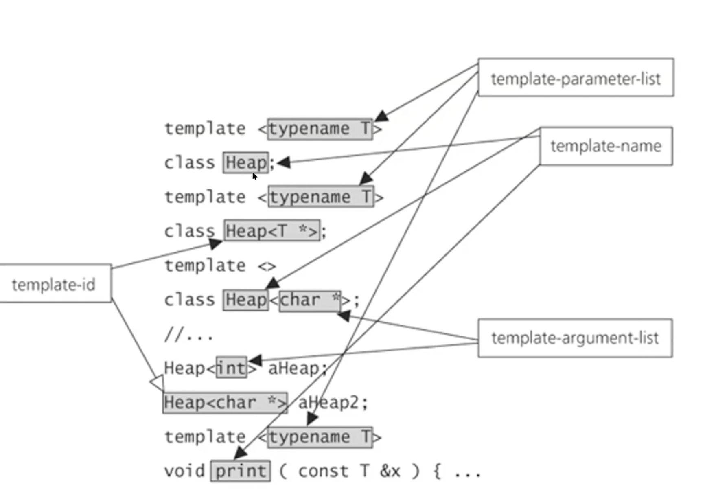
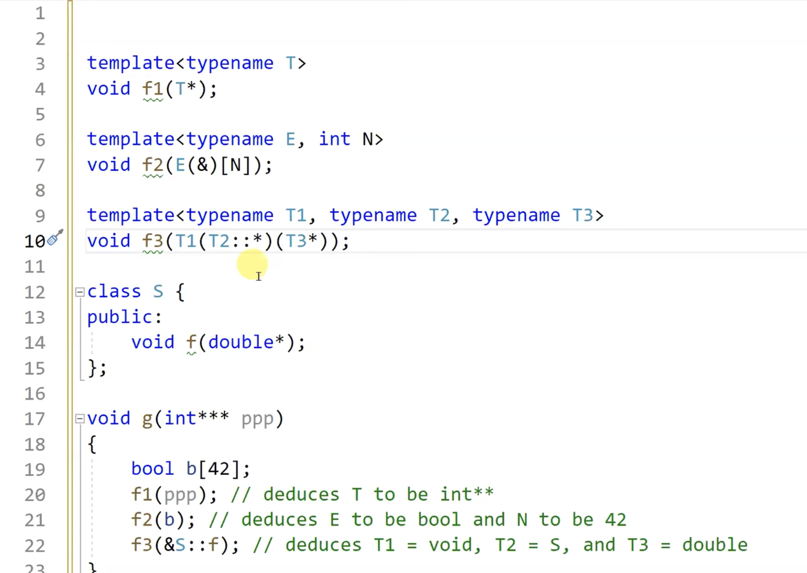

# 15.hafta

## İçindekiler

- [15.hafta](#15hafta)
  - [İçindekiler](#i̇çindekiler)
- [26\_30\_09\_2023](#26_30_09_2023)
    - [En çok yapılan deduction hataları](#en-çok-yapılan-deduction-hataları)

# 26_30_09_2023

## Template Temel Hızlı Tekrar



Template argument deduction: template argümanlarını bilme aşamasında, argümanların türünün bilinmesine deniyor

### En çok yapılan deduction hataları

```cpp
template <typename T>
void foo(T);

template <typename T>
void foo(T&);

template <typename T>
void foo(T&&);
```

- 1.için referanslık ve constluk düşüyor.
- 2.için constluk düşmüyor.

Çıkarım T'için yapılıyor, parametre için değil.

Diziler için sol taraf referansı olduğunda çıkarım int[] olarak yapılıyor. Array decay olmuyor.

bazı durumlarda çıkarımın yapılması kodun çağırılıp çağırılmasına bağlı değil

```cpp
template <typename T>
void foo(T,T);

int main()
{
    void (*fp)(int,int) = &foo;
}
```

- Çıkarım için incomplete type türünden bir sınıf tamamlayın ve bu şekilde çıkarımın nasıl yapıldığını görebileceğiz

```cpp
template<typename T> 
class TypeTeller;
```

```cpp
template<typename T,typename U>

void foo(std::array<T,,sizeof(U)>,std::array<U,sizeof(T)>);

int mian()
{
    std::array<int,sizeof(double)> a;
    std::array<double,sizeof(int)> b;
    std::array<double, 5> c;
    foo(a,b);
    //foo(a,c); // Sentaks hatası oluşur çünkü, 1. parametre int oldu, sizeof(double) ve 5 aynı değil.
}
```

Çıkarım konusunda cpp ref örnek



Fonksiyonun parametresi fucntion pointer türünden template olabilir.

```cpp
template <typename T, typename U>
void func(T(*(U)));
``` 

- Pozitif lmabda idiomu

```cpp
#include <vector>
template‹typename T>
void func(T&& x, const std::vector‹T>& ivec);
int main()
{
    using namespace std;
    vector‹int › ivec(10);
    func(ivec[0], ivec);
}
```

- template parametresi default argüman alabilir. Varsayılan argümandan hareketle çıkarım yapılamaz. Myclass için sentaks hatası olmaz.


### Non-Type Template Parametreler

Tam sayı türlerinden olabilir. 
Objec türlerden olabilir.
Referans türü olabilir.
Fonksiyon pointer'ı ve member fonksiyon türü olabilir.
Gerçek sayı türleri de olabilir.

```cpp
template <int x>
class Nec{};
template <int*>
class Den{};
```

```cpp
class Myclass
{ public: double foo(double); };
int g{};
int foo(int);
template<auto x>
class A{};
template <int (*pf)(int)>
class C{};
template<double(Myclass::*)(double)>
class D{};
template<int &>
class E{};

int main()
{
    int ival{};
    A<5>ax;
    B<&g> bx;
    C<foo> cx;
    D<Myclass::foo> dx;
    E<g>ex;
}
```
