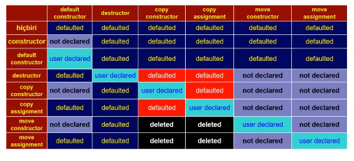
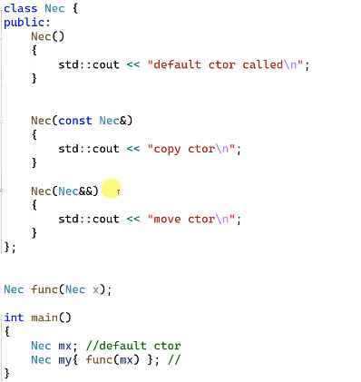
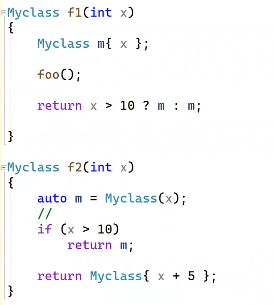
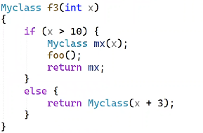
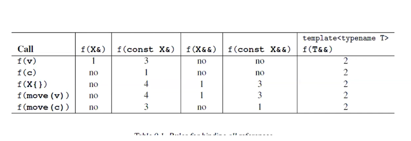

# 2.Hafta

- [2.Hafta](#2hafta)
  - [Copy Elision](#copy-elision)
    - [Mandatory Copy Elision](#mandatory-copy-elision)
      - [Unmaterailized Object Passing](#unmaterailized-object-passing)
      - [UNRVO (İsimlendirilmemiş bir nesnenin geri dönüş objesi olarak kullanılması)](#unrvo-i̇simlendirilmemiş-bir-nesnenin-geri-dönüş-objesi-olarak-kullanılması)
    - [NRVO ()](#nrvo-)
    - [Copy-Elision Yapılamadığı senaryolar](#copy-elision-yapılamadığı-senaryolar)
  - [Move Semantics](#move-semantics)
  - [Constructor'da Move ve Copy](#constructorda-move-ve-copy)
    - [Taşıma semantiği ve No except İlişkisi](#taşıma-semantiği-ve-no-except-i̇lişkisi)
      - [noexcept tekrarı](#noexcept-tekrarı)
        - [Exception Garantileri](#exception-garantileri)
    - [Moved From State](#moved-from-state)
      - [Invariant](#invariant)
        - [Invariantlar Neden Bozulur?](#invariantlar-neden-bozulur)
    - [Move Semantics With Generic Programming](#move-semantics-with-generic-programming)
      - [Perfect Forwarding (Universal Referans)](#perfect-forwarding-universal-referans)

> 3.ders başlangıcı

```c++
int main()
{
    int *p{}; //değişkenin türü int *
    p; //ifadenin türü int *
    int && r = 10; //değişkenin türü int ref ref
    r;//ifadenin türü ise int. 
}
```

## Copy Elision

Kopyalamanın yapılmaması demek, verimlilik açısından çok önemli, çünkü kopyalama çok pahalı bir işlem, eğer programın logic açıdan bir değişiklik yaratmadan kopyalamayı yapmama şansımız var ise kopyalamadan kaçınarak maliyet kazanıyoruz.



Kopyalama yerine taşınma yapılmasından değil, ne copy ne de move yapılması **kast edilmiyor**. Bazı sınıflar için çünkü bu durumun maliyeti aynı olabilir.

Eğer bir nesne hayata getirilmiyorsa, bir copy-elision'dan bahsetmemiz mümkün. Tüm senaryolarda bir nesneye taşıma veya kopyalama yapmak yerine var olan bir nesne olarak onun hayatını devam ettiriyoruz.

```c++

x = y; //burada bir copy-elision'dan bahsedemeyiz.

veconstructor <string> x,y;

x = y; //burada copy assignment çalışırken

x= std::move(y); //burada ise move assignment çalışır.
//fakat burada copy-elision'dan bahsedemeyiz.
```

Bir nesneği hayata getirirken

- copy-constructor
- move-constructor kullanabiliriz.
- Onu initialize eden değere bağlı olarak, default veya parametreli constructor ile hayata gelebilir.

Nerelerde karşımıza çıkıyor.


> Throw ifadeleri exception objelereine ilk değer veriliyor.

```c++
MyException ex;

throw ex; //derleyiciye exception object'e ex ifadesi ile ilkk değer veriyoruz ve burada copy-elision söz konusu olabilir.
```

C++17 ile bazı durumlar *mandatory* hale getirildi fakat, bu senaryolarda zaten bir kopyalama yok. C++17 ile artık PR-val expression tanımı değişti ve artık PR-val bir nesneye ilk değer vermeye yönelik bir reçete ve burada ne zamanki bir nesne oluşturuluyor, temproray metarlization ile bir nesne oluşuyor. Bu gerçekleşmediği sürece bir nesnenin hayata gelmesi mümkün değil.

Mandatory copy-elision sınıfın copy ve move construconstructorlarının olmasına gerek yok, eğer bu zorunlu bir şey olmasaydı ve copy ve move construconstructorları olmasaydı derleyiciler burada copy-elision yapamıyordu.

Mandatory'nin optimizasyon olması ile

- Çağrılarbilir move ve copy olmadan derlenebiliyor
- Debug modunda çalışması ve üretilen kod farklı olabilirdi. Logic aynı olsa bile.

---

> Örneklerde kullanılacak myclass sinifi:


---

### Mandatory Copy Elision

C++17 itibari ile PR-value expression tanımı değişti bu bir nesneye ilk değer vermeye yönelik bir reçete, temprorary materilization ile bir nesne oluşuyor. Pr-value to X value ile bir materilization gerçekleşiyor.

`Myclass m = Myclass {Myclass {Myclass {}}};`

Burada derleyici bir optimizasyon yapmasa: *default->copy->copy* construconstructor oluşturabilirdi. Artık burada result object'ini bulana kadar nesne oluşturulmuyor. Bir sentaks hatası yok ve sadece 1 kez default constructor çağırılıyor. Bu bir optimizasyon değil, bir zorunluluk.

```c++
void foo(Myclass){}
int main()
{
    foo(Myclass{}); // Unmaterailized Object Passing
}
```

Bu senaryoda da kopyalama yok ve sadece 1 kez default constructor çağırılıcak. Eğer burada copy/move constructor delete edilmiş olsa bile kopyalama olmayacak.

- Mandator copy elision tek copy elision çeşidi değil.

#### Unmaterailized Object Passing

İsimlendirilmemiş bir nesne kullanmak daha verimli kod oluşturmaya katkı yapma ihtimali var. Örneğin,

```c++
int main()
{
    Myclass m;
    foo(m);
    foo(std::move(m));
}
```

Olarak yazsaydık, kopyalama yapılacaktır. Artık bu kodda copy constructor çağırılıyor. Eğer nesne sadece fonksiyona bir argüman olarak geçmekse isimlendirilmeden kullanılan nesne verim ve maliyete yarar sağlayabilir.

> İstisnai durumlar olabilir. Örneğin kodun okunması ve test edilmesi çok zor ise.

#### UNRVO (İsimlendirilmemiş bir nesnenin geri dönüş objesi olarak kullanılması)

```c++
Myclass foo(int x){    return Myclass{x};}
int main(){    auto m = foo(123);}
```

Burada copy-elision olması zorunlu. Bu çok önemli bir garanti, kopyalama ve taşınamayan nesneler olsa dahi burada fabrika fonksiyonlarını yazabiliyoruz.


İfadenin değeri **kullanılmasa**(discard edilse) dahi temprorary metarilization gerçekleşicek.

Temproray materailization örnekleri.

`const myclass & r = myclass{};`
`myclass && r = myclass{};`
`auto val = myclass{}.foo();` Eğer ortada bir nesne yoksa onun fonksiyonunu çağıramayız.

- Return value optimization ve mandatory.

### NRVO ()

- Mandatory değil ve derleyici optimizasyon yapıyor. Optimizasyonun yapılması için special member functionların olması gerekiyor.

Derleyicinin optimizasyon yapması dokümante edilmiş olsa dahi, move ve copy constructor'un olması gerekli.

Derleyicilerin yetenekleri burada birbirinden farklı. *clang* derleyicisinin yapabildiği senaryolarda gcc bile yapamıyorlar.

Bu örnek için tüm derleyiciler için copy elision optimizasyonu yapılıyor. Bu kodun çalışması için copy/move constructor'unun olması lazım.

```c++
Myclass foo(){    
    Myclass m;    
    //other code.
    //m.foo();
    //m.bar();
    //m.baz(); gibi fonksiyonların olmasıda bu optimizasyonun yapılmasına engel olmayabilir.
    return m;
}

int main()
{
    Myclass mx = foo();
}
```

> otomatik ömürlü nesneler move eligible olduğu zaman move constructor devreye giriyor olabilir.


> Ekstrem bir neden yoksa move constructor no-except taşımalı.

- Eğer burada copy-constructor bir yan etkiye sahip ise,**as-if**'in çiğnendiği bir yer, eğer burada copy-constructor/move-constructor çağırıldığında optimizasyon yapılmayacağı üzerine kurararsak o **yan etki gerçekleşmeyecek!!!**
  
> **as-if rule** Derleyici programın çıkışına etki etmediği sürece istediği optimizasyonu yapabilir. Copy-elision optimizasyonu burada bu etkiyi yok edicek.
  
```c++
Myclass foo()
{
    Myclass x{};
    ///
    return x;
}
```

Eskiden bu optimizasyonu yapabilmek için **out-parameter** kullanılıyordu onun yerine artık doğrudan return parametre kullanılıyor. Çok sınırlı olarak out-value bu iş için kullanılsa dahi. Sıradışı senaryolar hariç burada copy-elision olucak ya da move-semantics devreye giriyor.

`void foo(Myclass&)` yerine `Myclass foo()`. Artık semantik açıdanda pratik olarak kullanabiliyoruz.

### Copy-Elision Yapılamadığı senaryolar

Bunların bir kısmı derleyiciye bağlı olabilir, fakat bazı durumlar için bu derleyiciden bağımsız olarak mümkün olmuyor. Parametre değişkeninin return parametresi olması.



- Nec isimli bir sınıf ve func isimli bir fonksiyonumuz var. Burada Nec parametresinin değeri belli ve bu durumda name return value optimization gerçekleşmiyor.

```c++
Nec func(Nec x){    //use x;
    return x;}
```

Bir diğer durum döndürülen nesnenin bir koşula bağlı olması lazım.



f1 fonksiyonu, 2. ve 3. operandları ayrı iki nesne olduğu için burada doğrudan copy-constructor çağırılıyor.

f2 fonksiyonunda bir yerel değişken tanımlanmış ve x'in değeri 10'dan büyükse return objesinde temprorary var, derleyici burada copy-elision gerçekleştirilebiliyor.



f3 fonksiyonunda ki optimizasyon derleyiciye bağlı.

- Return ifadesinde move kullanma fakat bunun istisnası olan bir yer f1,fonksiyonu.

Eğer kalıtım bir söz konusu ise, oradada RVU yapma şansı kalmıyor.

```c++
class force_rvo
{
public:
    force_rvo(int)
    {
        std::cout << "force_rvo(int)\n";
    }
    force_rvo(const force_rvo &);
    force_rvo(force_rvo &&);
};

force_rvo foo(){}
```

Burada eğer linked hatası alınırsa return value optiimization yapılmadığını gösteriyor.

> Copy-elision bizim için en iyi seçenek, eğer bu mümkün değilse ve taşıma ya da kopyalamadan biri yapılacaksa maliyet olarak move semantics seçiebilir olan.

## Move Semantics

Artık kullanılmayacak bir nesne söz konusu olduğunda o nesneyi başka bir nesneye kopyalamak yerine o nesenin kaynağını başka bir nesneye aktarmak.

- Move constructor ve assignment bazı durumlarda derleyici tarafından yazılıyor, eğer bunlar bizim beklediğimiz gibi yazılıyorsa bırakın olsun.
- Eğer sınıfın veri elemanı bir handle değilse, derleyicinin yazdığı move ve copy constructor mükemmlel bir şekilde işimizi görür.

```c++
class Myclass
{
public:

//derleyicinin yazacağı copy ve move constructor
    Myclass(const Myclass& other): m_vec(other.m_vec), m_str(other.m_str){}
    Myclass(Myclass&& other): m_vec(std::move(other.m_vec)), m_str(std::move(other.m_str)){}
//assignment ise
    Myclass& operator=(const Myclass& other)
    {
        if(this == &other)
            return *this;
        m_vec = other.m_vec;
        m_str = other.m_str;
        return *this;
    }
    Myclass& operator=(Myclass&& other)
    {
        if(this == &other)
            return *this;
        m_vec = std::move(other.m_vec);
        m_str = std::move(other.m_str);
        return *this;
    }
private:
    std::vector<int> m_vec;
    std::string m_str;
};
```

Yukarıdaki dilin kuralı ve bunun bu şekilde

> Ideali Rule-of-zero: Derleyicinin özel üye fonksiyonlarını yazması

Eğer bu fonksiyonların değişmesi gibi bir gereklililk varsa resource handle olması dışında, derleyicinin oluşturduğu kodun moved-from state'teki nesnelerin invariantlarını bozuyor olması ve bu moved-from state için belli garantileri vermek istiyorsak ve derleyici bizim istediğimiz durumu oluşturmasını istiyorsak kodu programcının yazması. Burada bir önlem almamız gerekiyor. Standart kütüphanede de bunun örnekleri var.

Derleyici bir fonksiyonun geri dönüş değerine göre copy yerine move assignment yada constructor'ı çağırabilirdi.

Normalde bizim move constructor için bunaa müdahale etmemiz gerekmiyor. Örneğin:

- Bir fonksiyonun geri dönüş değerini `const` yapmak, derleyicinin move-constructor'u çağırmasını engelliyor

```c++
const Myclass foo(int x)
{
    Myclass m(x);
    return m;
}

Myclass foo1(int x)
{
    Myclass m(x);
    return m;
}


int main()
{
    Myclass mx;
    mx = foo(23); //copy assignment çağırılıyor.
    mx = foo1(45); //move assignment çağırılıyor.
}
```

- std::move(), çağırma çünkü bu derleyicinin optimizasyon yapmasını engelleniyor ve copy-elision engelleniyor. Pessimistic move deniyor, otomatik ömürlü nesnelerde zaten move constructor çağırılmasına bir engel yok. Derleyici bu durumda
optimizasyon yapamıyor ve burada copy-ellision yapılamıoyr ve move constructor çağırılıyor.

```c++
Myclass foo()
{
    Myclass x;
    //other code
    return std::move(x);
}
```

Fonksiyonun geri dönüş değerini bunu gerektirecek bir durum olmadığı sürece yapma.

Koda müdahale etmemiz gereken bir yer, kopyalama işlemi yapılacakken bilerek ve istiyerek bu nesenin kaynağını başka bir nesneye aktarmak istiyorsak.

```c++
int main()
{
    Myclass m{24};
    Myclass x = std::move(m); //veya static-cast ile
}
```

## Constructor'da Move ve Copy

Sınıfların constructor'ını yazarken çoğunlukla, constructor'a gelen argüman ile sınıfın veri elemanlarını initialize ediyoruz. Bu durumda move constructor'ı yazmamıza gerek yok.

```c++
using svec = std::vector<std::string>;
class Nec
{
public:
    Nec(Myclass x):mx(std::move(x)){}
private:
    Myclass mx;
};

int main()
{
    Nec myec(Myclass{12});
    Myclass m;
    Nec mynec1(m); //copy constructor + move constructor
    Nec mynec2(std::move(m)); //move constructor + move constructor
}
```

Bu durumda programcının seçeneklerden hangisi uygunsa onun seçilmesi daha iyi ve burada duruma göre uygunluğa göre karar vermek. Seçeneklerin ne olduğunu bilmek lazım:

1. Clasic versiyon: fonkyonun parametresini const yapmak, burada bu ekstra bir maliyet getirebilir.
2. Tek bir fonksiyon yapmak ve değeri atarken std::move yapılarak kullanılması `Nec(Myclass x): mx(std::move(x)){}` şeklinde.
3. `Nec(const Myclass& m);` ve `Nec(Myclass&&x)` şeklinde 2 farklı constructor ile taşıma ve kopyalama işlemlerini ayırmak.

Parametre sayısı artarsa bunun bakımı için daha fazla parametre yazmak gerekiyor. Burada kesin bir cevap yok ve duruma göre karar vermek gerekiyor.

Taşıma semantiğinden faydalanmak için böyel bir yol izlenebilir.

Eğer parametre sayısı fazlalaşırsa, bu bir problem olabilir.

### Taşıma semantiği ve No except İlişkisi

#### noexcept tekrarı

Modern C++ ile dile eklendi.

> *Exception specification* sentaksı modern c++ ile dilden kaldırıldı.

```c++
foo(); //exception throw edebilir noexcept(false)
foo()noexcept;//exception throw etmez noexcept(true)
foo()noexcept(logic);//eğer logic true ise exception throw edebilir.

void foo()noexcept(sizeof(int) == 4);
```

Kullanım amacı daha çok generic kodlar içerisinde verilen türüne bağlı olarak exception throw edip/etmeme garantisini vermek için kullanılıyor. Artık fonksiyonun imzasının bir parçası fakat **function overloading'te** kullanılamıyor.

```cpp
template<typename> T
void func(T)noexcept(std::is_nothrow_constructible_v<T>); //burada noexcept(true) veya noexcept(false) olması T'türünün constructor'ının noexcept olup olmamasına bağlı.
void func(T x )noexcept(noexcept( x + x)); //ya da bu ifadenin yürütülmesi durumunda bir exception olup olmamasına bağlı.
```

- Fonksiyon pointerları ile de alakalı

```c++
void foo(int)noexcept;
int main()
{
    void (*fp)(int) = foo;
    constexpr auto b = noexcept(fp(12)); //b'nin false oluyor.
    void (*fp1)(int)noexcept = foo;
    constexpr auto a = noexcept(fp1(12)); //a'nın değeri true oluyor
}
```

- typededuction ile

```c++
void foo(int)noexcept;
int main()
{
    auto f = foo;
    constexpr auto b = noexcept(fp(12)); //b'nin değeri true oluyor.
    //ve bu durumda auto f çıkarımının noexcept ile yapıldığını anlıyoruz.
}
```

```c++
class Base
{
public:
    virtual void foo();//Exception throw edebiliyor. Bu interface'i kullananlar exception throw etme ihtimalini göz önüne almamlılar.
    virtual void func()noexcept;
    virtual void bar()noexcept(sizeof(int)> 4);
};

class Der :public Base
{
public:
    void foo()noexcept override; //burada sentaks hatası yok, exception throw etmeyeceğine dair bir garanti verebilir. Fakat bunun tam tersi mümkün değil.
    //void func(); //sentaks hatası
    void bar()noexcept(sizeof(int)>8) override;
};
```

> Liskov substition  Promise no less, require no more. Kalıtımdaki türümüş sınıflar için daha azını vaadedmezsin ve daha fazlasını talep edemezsin. Kalıtımdaki türemiş sınıflar için geçerli.

---

Sınıfın move constructor/assignment ve swap/memory deallocation fonksiyonlarının noexcept garantisi vermesi gerekiyor.

- Bir sınıfın destruconstructorı default olarak noexcept.
- Derleyici özel üye fonksiylarının noexcept olup olmadığını koda bakarak static olarak anlıyor. Ona göre bu specifier ile niteliyor

```c++
class Myclass{
    Nec n;
    static_assert(std::is_no_throw_destructible_v<Myclass>); //emin olmadığımız durumda bu şekilde sınayabiliriz.
};
class Nec{};


int main()
{
    using namespace std;
    cout.setf(ios::boolalpha);
    cout << "is default constructor noexcept: " << is_nothrow_default_constructible_v<Myclass> << "\n";
    cout << "is destructor noexcept: " << is_nothrow_default_destructible_v<Myclass> << "\n";
    cout << "is copy constructor noexcept: " << is_nothrow_copy_constructible_v<Myclass> << "\n";
    cout << "is copy assignment noexcept: " << is_nothrow_copy_assignable_v<Myclass> << "\n";
    cout << "is move constructor noexcept: " << is_nothrow_move_constructible_v<Myclass> << "\n";
    cout << "is move assignment noexcept: " << is_nothrow_move_assignable_v<Myclass> << "\n";    
}
```

Hepsi true dönüyor.

Eğer sınıfa bir string alaman konursa, copy ve copy assignment false oluyor, eğer string sınıfının kopyalama işlemleri bu garantiyi verseydi myclass sınıfıda aynı garantiyi vericekti.

Emin olmadığımız durumda `static_assert` ile bunu test edebiliriz.

C++20 ile default ederkende yapabiliyoruz. `Myclass()noexcept = default;` şeklinde.

##### Exception Garantileri

Bir fonksiyonun exception gönderme garanti seviyeleri:

- Basic garanti: herhangi bir şekilde fonksiyon exception throw ederse nesne invalid bir state'de olmayacak ve bir kaynak sızdırmayacak. Program state'i halen geçerli durumda kalmalı.

```c++
void foo() // basic garantiyi vermiyor.
{
    auto p = new std::string("ahmet");
    //other code
    delete p; 
}
```

- Strong garanti: Basic garantinin verdiği garantileri veriyor ve buradan exception ile çıkılırsa fonksiyonun state'inde herhangi bir değişiklik olmayacağını belirtiyor. Bu fonksiyona çağrı yapıldığında, ya işini yapıcak ya da programın state'i çağırılmadan önceki konumda kalıcak. **Copy and Swap**.
- - Standart kütüphanenin bir çok fonksiyonu da bu şekilde niteleniyor.

- NoExcept Garantisi: Eğer bu fonksiyon çağırılırsa exception throw edilmeyecek. Eğer bu durumda bir exception throw edilirse `std::terminate`'in çağırılıyor.
- - Bu garantiyi ya fonksiyonun exception throw etmeyeceğinden emin olmamız gerekiyor.

Move constructor ve move assignment noexcept garantisi vermesi derleyicinin daha optimize bir kod yazabileceği anlamına geliyor.

```c++

class Student{
public: 
    Student(const char *name): m_name(name){}
    Student(const Student& other): m_name(other.m_name){std::cout << "copy ctor" << m_name<< "\n";}
    Student(Student&& other): m_name(std::move(other.m_name)){std::cout << "move ctor"<<m_name<< "\n";}
    std::string getName()const{return m_name;}
private:
    std::string m_name;
}

int main()
{
    std::vector<Student> vec{"Omer faruk yesilyurt", "Ali Hüseyin Mehmet", "Remzi Cansin Onder"}
    std::cout<< "capacity: " << vec.capacity() << "\n";
    vec.push_back("Aytemiz Nazligul Aybakan"); //reallocation olucak
    //
    std::cout<< "capacity: " << vec.capacity() << "\n";
}
```

Eski bellek alanından yeni alanına aktarılırken copy constructor çağırılıyor. Bunun nedeni move constructor'ın noexcept olmamasıydı. Eğer move constructor aşağıdaki gibi

`Student(Student&& other)noexcept: m_name(std::move(other.m_name)){std::cout << "move ctor"<<m_name<< "\n";}` noexcept garantisi verilmesi gerekiyor. Burada `push_back` strong garanti veriyor.

```c++
class Mystr
{
public:
    Mystr(): m_str(1000,'A') //parantez olduğunda fill, küme parantezi olduğunda initializ oluyor.
    {}
    Mystr(const Mystr& other): m_str(other.m_str){}
    Mystr(Mystr&& other)noexcept: m_str(std::move(other.m_str)){}
private:
    std::string m_str;
}

int main()
{
    using namespace std::chrono;
    std::vector<Mystr> vec(1'000'000);    
    std::cout<< "capacity: " << vec.capacity() << "\n";
    auto tp_start = steady_clock::now();
    vec.reserve(vec.capacity() + 1);
    auto tp_end = steady_clock::now();
    cout << duration<double, std::milli> (tp_end - tp_start).count() << "\n";
    std::cout<< "capacity: " << vec.capacity() << "\n";
}
```

> 4.ders başiangıcı

Override keyword'ü contextual keyword. Belirli bir contex'te anahtar sözcük gibi davranırken, diğer durumlarda bir identifier gibi kullanabiliyoruz.

- Bir taban sınıfın bir fonksiyonu override ederken bu keyword ile belirliyoruz. Örneğin aşağıdaki fonksiyonda foo fonksiyonunda virtual dispatch gerçekleşmeyecek.
- Taban sınıfın virtual olmayan bir fonksiyonunu override etmeye çalıştığımızda, bu durum sentaks hatası oluşturmuyor kod programcının beklentisindeki gibi çalışmayabilir.
- Taban sınıfın bir sanal fonksiyonu var ve birden fazla türemiş sınıf, bu sınıftan fonksiyonu override ediyor olabilir ve taban sınıfından fonksiyonun da bir değişiklik yaptığımızda burada değiştirilmesi gereken yerleri bulmamıza yarıyor.

Bu yüzden override ettiğin fonksiyonlarda bunu kullan.

```c++
class Base
{
public:
    virtual void func();
      virtual void foo(unsigned int);
};

class Der : public Base
{
public:
    void func() override; //override keyword'ü ile override edildiğini belirtiyoruz.
    void foo(int);
}
```

- Destructor için her zaman `noexcept` ile bildiriliyor. Onun için bunun exception throw edilmemesi gerekiyor

```c++
class Myclass{public:    ~Myclass();};
class Myclass1{public:    ~Myclass();};
class Myclass2{public:    ~Myclass()noexcept(false);};

int main()
{
    using namespace std;
    cout << is_nothrow_destructible_v<Myclass>; //true
    cout << is_nothrow_destructible_v<Myclass1>;  //true
    cout << is_nothrow_destructible_v<Myclass2>;  //false
}
```

Bir önceki derste kalınan örnekten devam,

```c++
#include <iostream>
#include <string>
#include <chrono>
#include <vector>
class Mystr
{
public:
    Mystr(): m_str(1000,'A') //parantez olduğunda fill, küme parantezi olduğunda initializ oluyor.
    {}
    Mystr(const Mystr& other) = default;
    Mystr(Mystr&& other)noexcept: m_str(std::move(other.m_str)){}
    //Mystr(Mystr&& other)noexcept(false) = default;
    //Mystr(Mystr&& other)noexcept = default;
private:   std::string m_str; };

int main()
{
    using namespace std::chrono;
    std::vector<Mystr> vec(1'000'000);    
    std::cout<< "capacity: " << vec.capacity() << "\n";
    auto tp_start = steady_clock::now();
    vec.reserve(vec.capacity() + 1);
    auto tp_end = steady_clock::now();
    cout << duration<double, std::milli> (tp_end - tp_start).count() << "\n";
    std::cout<< "capacity: " << vec.capacity() << "\n";
}
```

[ornek kod](https://onlinegdb.com/T03qiqFB7)

> Ölçmek istediğimiz event ne ise ondan önce bir zaman oluyoruz ve ondan sonra bir zaman oluyoruz ve aradaki farkı `duration`  alıyoruz. Representation türü duration'ın ilk template paramteresi, 2.paramteresi ise ration türü.

Kendi sınıflarımızda, implicitly declared ise derleyici karar veriyor eğer bu durumda kendimiz belirliyiceksek genellikle belirli koşullarda karar veriyoruz.

### Moved From State

Bir nesnenin destructor o nesnenin kaynağı çalınsa dahi erişilebilir olması gerekiyor. Öyle senaryolar olabilirki, bir nesnenin kaynağını bilerek ve isteyerek verim artışı sağlammak için o nesnenin kaynağını çalıyırouz. Bu nesneye moved-from statedeki nesne diyoruz.  Burada standard kütüphane  moved-from state'deki nesne için bazı garantiler veriyor.

- Destructible olması
- Unspecified fakat geçerli bir durumda olması
- - Örneğin func fonksiyonunda r'nin değerinin ne olduğunu bilemeyiz, ve buna yeni bir değer atabiliriz. Buna güvenerek kodumuzu yazabiliriz.

```c++
class Myclass{};
void func(Myclass & r) {    }
void foo(std::string & r){r.is_empty();}
```

swap template'i

```c++
template<typename T>
void Swap(T&x, T&y)
{
    T temp(std::move(x));
    x = std::move(y); //x'i moved-from statte'ki haliyle kullanıyoruz.
    y = std::move(temp);
}
```

3.Parti kütüphaneler için bu garantileri vermiyor olabilir. Bu kütüphaneleri kullanırken moved-from state'e dikkat etmek gerekiyor.

- Standart kütüphane için genellikle moved-from state'deki nesneyi genellikle default state'e getiriyor

#### Invariant

- func fonksiyonun Myclass nesnesini kullanabilmesi için Myclass sınıfının invarian'ının tutuyor olması gerekiyor. Eğer tutmuyorsa logic bir hata var demektir.
- Eğer bu invarianlar başka bir api kullanımı yüzünden tutmuyorsa burada fonksiyon kullanabiliriz.

```c++
class Myclass{
private:
    int mx;
};
void func(Myclass x){ }
```

Bizim kendi türlerimiz söz konusu olduğu zaman:

1. Yazılımını derleyiciye bırakmak
2. Move memberları kendimiz yazabiliriz. Örneğin sınıfın bir elemanı handle, burada derleyicinin yazacağı copy'ye kendimiz yazıyoruz. Sınıfın bu yönetimi kendimiz yapmalıyız.
3. Copylama/taşıma delete edilmiş olsun.

Bir sınıfı kendimiz yazıyorsak, onu derleciyinin oluşturduğu move memberları nasıl yazması gerekiyorsa o şekilde taşıyor.

- Primitive türlerin taşınması ve kopyalanması arasında bir fark yok.

Örneğin yukarıda mx'in 0 olması invariantları bozuyorsa bunu belirtmemiz gerekiyor.

a. Hiç dokunmadan, moved-from state'e ilişkin API'yı kullanacaklara bunu dokumante etmek.
b. Move memberları tamamen kullanıma kapatabiliriz.
c. 3 derleyicinin yazdığı move-memberlar invariantları bozacağı için burada move constructor'ı kendimiz yazabiliriz.

> Move constructor'ı yazarken, destructor, copy constructor'ı kendimiz yazıyorsak move memberları da bizim implemente etmemmiz gerekiyor.

- Bazen move memberların yazılmasının nedeni, derleyicinin yazdığı move memberların sınıfın invariantlarını bozuyor.

##### Invariantlar Neden Bozulur?

- Invariantların kısıtlı olması, sınıfın belli üye memberlarının kısıtlı olması gerekiyordur. Bu durumda move memberlarının yazılması gerekiyor.
- Sınıfların üye elemanları arasında bir bağımlılık olabilir. Örneğin bir üçgen sınıfında kenarları ve alanı tuttuk, bir durumda kenarlar değiştiğinde alanın da değişmesi gerekiyor. Eğer değişmezse invariantları bozulmuş oluyor.
- Sınıfın smart-pointer'ları yüzünden invariantlarda bozulmuş olabilir.

```c++
class Card
{
public:
    Card(const std::string&val): m_val(val)
    {
        //assertValidCard(value); //ensure the value is always valid
    }
    std::string getVal()const{return m_val;}

private:
    std::string m_val; // ace + "-of-" + diamonds
};

int main()
{
    Card c1{"king_of_herats"};
    auto c2 = std::move(c1);
    std::cout << c2.getVal() << "\n"; //moved from state'de boş oldu fakat burada invariantlık bozulmuş oldu.
}
```

- Moved from state burada tutumuyor. Bu örnek için default constructed bir state'de bulunmuyor. Bu sınıfın invariant'ı taşınmış olsa bile `ace+of+diamonds` gibi bir durumda olması gerekiyor.

- Sınıfın move memberlarını değilde, diğer çağırılabilecek fonksiyonlarını invariantlarına göre döndürebilir.
- Değer taşıyıp taşımadığını test edebiliriz.
- Dokümante edebiliriz. Fakat bunu çok tercih etme

```c++
#include <iostream>
#include <string>

class InString
{
public:
    IntString(int val = 0): m_val(val), m_sval(std::to_string(val)){}
    void set_value(int i)
    {
        m_val = i;
        m_sval = std::to_string(i);
    }
    void print()const
    {
        std::cout<<"[" << m_val << "/'" << m_sval << <<"']\n";
    }
    private:
    std::string m_sval;
    int m_val;

};
int main()
{
    IntString is1{12};
    IntString is2;
    is1.print();
    is2.print();
    is2 = std::move(is1);
    is1.print();
    is2.print();
}
```

- taşımadan sonra is1'in invariant'ı bozulmuş oluyor.

```c++
#include <iostream>
#include <string>
class SharedInt
{
public:
    explicit SharedInt(int val): m_sp{std::make_shared<int>(val)} {}
    
    std::string as_string()const{return std::to_string(*m_sp);}
    /*
    Yaparak ortada kaldırılabilir.
    std::string as_string()const{
        
        if(m_sp)    
            return std::to_string(*m_sp);
        else 
            return "";
    }
    */
private:
    std::shraed_ptr<int> m_sp;
};
int main()
{
    SharedInt x{20};
    SharedInt y{x};
    std::cout << x.as_string() << "\n";

    SharedInt a{29};
    SharedInt b{std::move(a)};
    std::cout << a.as_string() << "\n";
}
```

SharedInt nesnesine bir değer veriliyor ve böylece birden fazla sharedint nesnesi aynı kaynağa erişilebiliyor. Burada static ile karıştırılmamalı.

b'ye a'yı taşıdık, burada boş bir nesneyi dereference etmiş olucaz.

### Move Semantics With Generic Programming

Taşımanın olup olmamasının ne olduğu bazen türün tanımına bağlı oluyor.

#### Perfect Forwarding (Universal Referans)

Özel bir sentaks ile oluşturuluyor.

```c++
template<typename T>
void func(T&& x)//x universal referans
{
    //...
}

int main()
{
    auto &&r = 12; //r bir universal referans    
}
```

Forwarding referansın birden fazla kullanım alanı ortaya çıktı.

Universal referans demek, bu referansa her value kategorisinden const veya non-const tüm değerler bağlanabilir demek.

```c++
void func(std::string &&r) {}
//bu fonksiyona sadece ve sadevece rvalue bağlanabilir.
template<typename T>
void func(const T&){} //const sol taraf referans. 
//bu fonksiyona da her şeyi buraya gönderebiliriz. 
```

- Bu iki fonksiyonun farkı, gönderilen varlığın değer kategorisini artık bilmemiz için bir imkan yok. 2.fonksiyon ayrıca const'luk bilgisini de kaybediyoruz.
- Fakat Universal referans ile bu bilgileri kaybetmiyoruz. Bu bilgileri compile time'da kullanabiliriz.

Bu fonksiyonlara çağrı yaparken template argüman `explicit olarak belirlenmezse`

| constness      | Value Category | T Type          | x Type           |
| -------------- | -------------- | --------------- | ---------------  |
| Non constant   | L Value        | Myclass &       | Myclass &        |
| Non constanat  | R value        | Myclass         | Myclass &&       |
| Const          | L value        | const Myclass & | const Myclass&   |
| Non constanat  | R value        | const Myclass   | const Myclass && |

- Bu fonksiyona her şey gönderilebiliyor.

```c++
template<typename T>
void foo(T&& x)
{
   
}
```

Artık `type_trait` kullanılarak argümanın const olup olmadığını anlayabiliyoruz. Value category'sini hem `x`'ten hem de `T` türünden anlayabiliyoruz. Gönderilen argümanın ne olup olmadığnı anlayabiliyoruz.

Peki bu ne işimize yarıyor?

Örneğin: başka bir fonksiyona gönderirken bu bilgileri kullanabiliriz.

```c++
template<typename T>
void foo(T&& arg)
{
    //eğer T türü referans türü ise
    bar(arg);
    //eğer T türü referans türü değil ise
    bar(std::move(arg));
    // Fakat bunu yapmak yerine artık std::forward kullanılaiblir.
    bar(std::forward<T>(arg)); //arg'in tü
}
```

- Eğer sol taraf değeri ise sol taraf değeri olarak, eğer sağ taraf değeri ise onu sağ taraf değerine dönüştürüyor.

**Perferct forwarding**: Bir fonksiyona gönderilen argümanın değer kategorisini ve constness bilgisini kaybetmeden başka bir fonksiyona göndermek.

Elimizde bir `foo()` fonksiyonu olsun ve bu fonksiyonu `call_foo()` üzerinden çağırmamız gerekiyor olabilir. Bu durumda bizim foo fonksiyonuna göndermek istediğimiz argümanların, call_foo fonksiyonu tarafından gönderilirken de
aynı değer kategorisinde ve constness bilgisinde olması gerekiyor.

Starndard kütüphane de kullanıldığı yerler. Container'ların `emplace` fonksiyonları. `make_unique` fonksiyonu.

```c++
class Myclass
{};

void func(const Myclass& x){std::cout << "func(const Myclass&)\n";}
void func(Myclass&& x){std::cout << "func(Myclass&&)\n";}
void func(Myclass& x){std::cout << "func(Myclass&)\n";}
void func(const Myclass&& x){std::cout << "func(const Myclass&&)\n";}

template<typename T>
void call_func(T&& x)
{
    func(std::forward<T>(x)); //func(Myclass&)
}

int main()
{
    Myclass m;
    const Myclass cm;
    func(m); //func(Myclass&)
    call_func(m);
    func(cm); //func(const Myclass&)
    call_func(cm);
    //func(std::move(m)); //func(Myclass&&)
    call_func(std::move(m));
    //func(std::move(cm)); //func(const Myclass&&)
    call_func(std::move(cm));
}
```

[ornek cıktısı:](https://onlinegdb.com/NW070Mayf)

- Eğer çağırılan fonksiyonun birden fazla paramteresi olsaydı.

```c++
template<typename T, typename U>
void call_foo(T&& x, U&& y)
{
    foo(std::forward<T>(x), std::forward<U>(y));
}
// variadic hale getirmek için
template<typename...Args>
void call_foo1(Arg&&...args)
{
    foo(std::forward<Args>(args)...); //pack expansion'dan faydalandık.
}
```

- MakeUnique fonksiyon şablonuna bakalım

```c++
teamplate<typename T, typename ..Args>
std::unique_ptr<T> MakeUnique(Args&&...args)
{    
    return std::unique_ptr<T>(new T(std::forward<Args>(args)...));
}
```

- Forward implementasyonu:

```c++
template<typename T>
constexpr T&& forward(typename std::remove_reference<T>::type& t) noexcept
//constexpr T&& forward(std::remove_reference<T>::type& t) noexcept
{
    return static_cast<T&&>(t);
}
```

- `remove_reference<T>` fonksiyonu T türünü referans olmaktan kurtarıyor artık T lvalue expresion, artık static cast ile lvalue türüne cast edilmiş olucak.
- - T türü Myclass türü ise return değeri Myclass& oluyor. Eğer T türü referans tür değilse, return değeri t'nin kendisi l-expression olmasına rağmen X-Value dolayısıyla R value expression oluyor.

Orijinal implementasyonu

```c++
template<typename T>
T&& Forward( std::remove_reference_t<T>& t) noexcept
{
    return static_cast<T&&>(t);
}

template<class T>
T&& Forward( std::remove_refernce_t<T> && t) noexcept
{
    static_assert(!std::is_lvalue_reference<T>::value, "Cannot forward an rvalue as an lvalue.");
    return static_cast<T&&>(t);
}
```

> Templateler implicitly inline aslında.

- T'nin türü yine Myclass ise paramteresi Myclass &&, static_assert ile bunu kontrol ediyoruz, burada T'türünün lvalue referans türü olmaması gerekiyor.
- Bunu yapmasının nedeni, rvalue'yu lvalue dönüştürülmesine gerek yok. Herhangi bir nedenden

```c++
class Myclass{};
int main()
{
    Forward<Myclass&>(Myclass{}); // bu senaryoda 2.fonksiyon sayesinde hata yakalınıyor.
}
```

call_func fonksiyonunu yazarken `declytpe` kullanarakta gerçekjleştirebiliriz.

```c++
template<typename T>
void call_func(T&& arg)
{
    func(std::forward<decltype(arg)>(arg)); //func(Myclass&)
}
```

Örneğin lambda ifadesinde aşağıdaki gibi kullanabiliriz.

```c++
int main()
{
    Myclass m;
    const Myclass m;
    auto fn = [](auto&& r){
        func(std::forward<decltype(r)>(r));
    };
    fn(m);
    fn(std::move(m));
    std::cout << "------------------\n";
    fn(cm);
    fn(std::move(cm));
    std::cout << "------------------\n";
}
```



Burada bir sorunlu durum function overloading resoulution'da karşımıza çıkıyor.

1 - 2 - 3 -4 seçimleri gösteriyor.

no: çağırılması vaiable değil.

```c++
class Nec
{
public:
    Nec() = default;
    Nec(const Nec&){std::cout << "copy ctor\n";}
    Nec(Nec&&){std::cout << "move ctor\n";}
    template<typename T>
    Nec(T&&){std::cout << "universal ctor\n";} 
};

int main()
{
    Nec nec;
    const Nec xnec;
    Nec a{xnec};
    Nec b{nec}; //burada copy ctor değil universal ctor çağırılıyor.
    Nec c{std::move(nec)};
    Nec d{std::move(xnec)};
    Nec e{10}; //universal constructor çağırılacak
}
```
