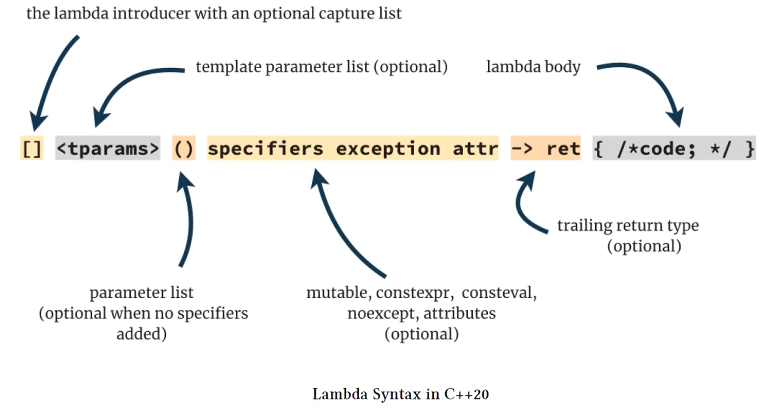

# 7.Hafta

---

> 05_08_2023

---

## Space Ship Operatörü

Bu operatörü çoğunlukla doğrudan kullanmıyoruz. Kullandığımız yer kendi türlerimiz için bu operatörü overload ettiğimiz yerler. Artık operatörler arasında bir ayrım yapılıyor ve bu ayrım:

1. `==` ve `<=>` operatörü
2. `!=`, `>`, `<=`, `>=`, `>` operatörleri

- Primary operatörler ***reversable*** (*derleyici uygun fonksiyon bulunmaması durumunda operandları yer değiştirebiliyor*).
- Secondary operatörler ise **rewritable** ( eğer x!=y  yok ise bunu !(x==y) olarak değiştirebilir.)

Bu da kendi sınıflarımız için `!=` değili yazmamıza gerek yok `==` yazmamız yeterli olacak. Aynısı diğer operatörleri yazmak yerine `<=>` operatörünü yazmamız yeterli olacak.

- Öğeler bildirim sırasına göre karşılaştırılır.

- `==` fonksiyonu için aşağıdaki örtülü dönüşümler yapılıyor.

```c++
class Myclass {
public:
    Myclass(int x = 0) : mx{x} {}
    bool operator==(const Myclass &other) const
    {
        return mx == other.mx;
    }
private:
    int mx;
};

int main()
{
    Myclass x{10}, y{20};
    auto b1 = x == y; // x.operator==(y)
    auto b2 = x != y; // !(x.operator==(y))
    auto b3 = x == 5;
    auto b4 = 5 == x; //C++20 öncesi bu legal değildi, derleyici 5 == x'için x.operator==(5) çağrısına dönüştürüyor.
}
```

- Sadece `<=>` default edilirse diğer 6 karşılaştırma işlemini de yapabiliyoruz

```c++
class Myclass {
public:
    Myclass(int x = 0) : mx{x} {}
    auto operator<=>(const Myclass &other) const = default;
    //auto operator==(const Myclass &other) const = default; bunu da default ediliyor
private:
    int mx;
};

int main()
{
    Myclass x{10}, y{20};
    bool b{};
    b = x == y; // x.operator==(y)
    b = x != y; // !(x.operator==(y))
    b = x != 5;
    b = 5 != x; 
    b = x == 5;
    b = x < y; // x<=> < 0 şeklinde de yazabilirdik fakat bu şekilde daha okunaklı
}
```

- Default edilmiş durumda derleyici yazdığı fonksiyonu, eğer öğelerin karşılaştırılması `noexcept` garantisi veriyorsa fonksiyonda `noexcept` garantisi veriyor.

```c++
template <typename T>
class Type{
public:
    [[nodiscard]] virtual std::strong_ordering
     operator<=>(const Type &)const requires(!std::same_as<T,bool>)= default;
};
```

- Geri dönüş değerinin `auto` olması generic kod kısmında işimize yarıyor. Burada geri dönüş değerini trail return type ile belirleyebiliriz.

```c++
template <typename T, typename U>
class Myclass {
private:
        T mx;
        U my;
public:
    auto operator<=>(const Myclass& other) const -> std::common_comparison_category_t<decltype(mx<=>mx),decltype(my<=>my)>
    {
        if(auto res = mx<=>other.mx; res != 0)
            return res;
        return my<=>other.my;
    }
};
```

- Vectorler için Lexicographical comparison yapılıyor.

```c++
int main()
{
    using namespace std;
    vector v1(100'000, 5);
    vector v2(5, 6);
    bool b = v1 < v2; // false

    //lexicographical comparison için 2 farklı container kullanabiliyoruz.
    list mylist{3,6,7,9,1};
    vector myvec{3,6,8,1};
    cout <<boolalpha <<lexicographical_compare(mylist.begin(), mylist.end(), myvec.begin(), myvec.end());//true
}
```

- C++20 ile öyle durumlar varki range'leri spaceship operatörü ile karşılaştırmamız gerekebilir, bunun için lexicoğraphical_compare_three_way algoritması eklendi ve bu fonksiyonun geri dönüş değeri `<=>` operatörünün geri dönüş değeri.

```c++
std::ostream& operator<<(std::ostream& os, const std::strong_ordering& so)
{
    return so == 0 ? os << "equal" : so < 0 ? os << "less" : os << "greater";
}

int main()
{
    list mylist{3,6,7,9,1};
    vector myvec{3,6,8,1};
    auto result = lexicographical_compare_three_way(mylist.begin(), mylist.end(), myvec.begin(), myvec.end());//true
    cout << result << "\n";
}
```

## Lambda İfadeleri, C++20 ile Gelen Yenilikler ve Tipik Idiomlar

- C++11 standartı ile dile eklendi.

Lambda ifadesi karşılığında bir local sınıf oluşturuyor ve ifade kategorisi PR-Value. Derleycinin oluşturduğu sınıf türüne `closure-type` deniyor. Nesneye ise `closure object` deniyor. Nested function'ın C++ karşılığı. Fonkisyon ihtiyacı olan nokta ile fonksiyonun arasındaki mesafeyi kapatıyor. Fonksiyona nerede ihtiyaç var ise orada tanımlıyoruz. Derleyicinin optimizasyon olasılıkları da optimize edilmiş oluyor.

### Örnek sorular

```c++
int g = 99;
auto fx = [=]{return g+1;}
auto fy = [g=g]{return g+1;}

int main()
{
    g = 500;
    cout << fx() << "\n"; //100
    cout << fy() << "\n"; //100
}
```

```c++
int main()
{
    auto x = {static int x{}; return ++x;}
    decltype(x) y;
    decltype(x) z;
    cout << y() << y() << z() << "\n";
    cout << y() << z() << z() << "\n";    
}
```

```c++
int main()
{
    const int x = 10;
    //auto f = [x]()mutable{++x;}; Sentaks hatası.  Capture close'da x ismi kullanılmış 
    //copy-capture ve burada sınıfın veri elemanı const, sınıfın üye fonksiyonu non-const olmasına rağmen
    //sınıfın üye elemanı const olduğu için sentaks hatası oluşuyor.

    //auto g = [x = x](){++x;};  Sentaks hatası.
    // Bunun legal olması için mutable olması gerekiyor, sınıfa bir veri elemanı koyacak ve buradaki x'ile initialize edilecek.
    //sınıfın üye fonksyionu const olduğu için burada sentaks hatası oluşuyor.
    auto h = [x = x]()mutable{++x;};
}
```

```c++
int main()
{
    int x = 4;
    auto y = [x = x + 1, &r = x]()
    {
        r+=2 ;
        return x*x;
    }();
    cout << x << " " << y << "\n"; // 6 25
}
```

```c++
int g = 5;
int main()
{
    auto f = [](int x = ++g){return x*x;};
    auto x = f();
    auto y = f();
    cout << x << " " << y << " " << g <<"\n"; // 36 49 7
}
```

```c++
double i{};
int main()
{

    auto f = [i =0 ]()-> decltype(i) {return 1;}();
    cout << is_same_v<decltype(f), int>;
}
```

### Hızlı Temel Tekrar



- Optional bir kısmı C++20 ile geldi.

```c++
int main()
{
    [](){}; //en basit lambda ifadesi
    [](){}(); //fonksiyon çağrı operatörünü böylede yazabiliyoruz.
    []{}(); //yukarıdaki ile aynı 

    [](int x){return x*6;}; //burada fonksiyon çağrısını yapmıyoruz. ; ile geçici nesnenin ömrü burada bitiyor.
    [](int x){return x*6;}(10);//bulunduğu yerde doğrudan çağırmak. Immidiately invoked function expression
    // bu fonksiyonu birden fazla kez çağırmak istersek closure-type'ı bir değişkene atamamız gerekiyor.
    auto f = [](int x){return x*6;}; //isimlendirilmiş bir function-object yapabiilriz.
    f(10);
    f(20);
    // İsim vererek kodu okuyana yardımcı olunuyor ve genelde const semantiğine uyulması gerekiyor.
}
```

- 1:31:44